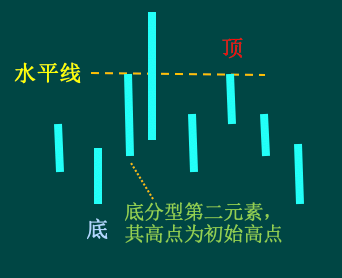
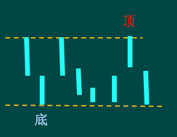
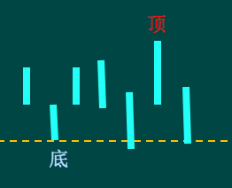
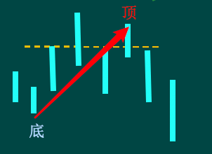
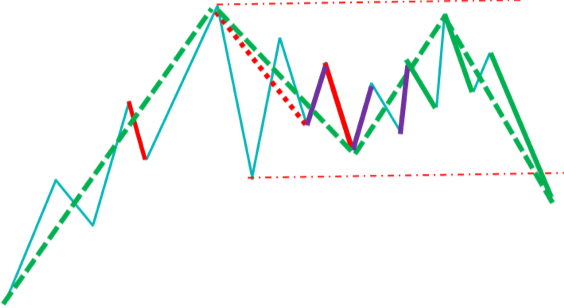

# 记录缠论学习

## 一 笔和线段

### (一)我的笔规则

1. 基于严格笔

2. 以下图,顶底能否成为一笔

   

   

   这里是个争议点,一种做法是:顶分型中最高那K线的区间至少要有一部分高于底分型中最低那K线的区间,另外是组成分型的3根K的最高最低点作为区间

   **我的规则是顶分型中最高那K线的区间至少要有一部分高于底分型中最低那K线的区间**

3. 如图:

   

   这里的顶底能否成为一笔?这里也非常有争议

   **我的规则是这里不能成为一笔.**

4. 关于分型的前包含和后包含是否都要处理?

​      **我的规则是只处理分型之间的前包含,目的是为了当下就能确定**

### (二)我的线段规则

线段历来是争议最大的部分

总规则：

基于特征序列的线段划分标准方法主要步骤就是：

先根据线段方向，找出特征序列，然后对特征序列进行标准化，寻找标准特征序列的分型，然后判断分型第1,2元素间是否有缺口，分为第一种破坏和第二种破坏；

第一种破坏比较简单直接，当即可断定线段结束；

第二种破坏则需要寻找反向特征序列的分型来进行确认，如果没有出现反向特征序列分型就新高新低，则仍为原线段的延续。

可以解决90%的线段划分问题

1. 特征序列合并:

向下笔之间高高合并 向上笔之间低低合并

2. 特征序列包含合并规则:

前包含：前面的完全把后面的包含在内

后包含：后面的完全把前面的包含在内

3. 特征序列分型成立条件

特征序列分型分为第一元素、第二元素(定义为分型起点)和第三元素

顶分型：第二元素高点在相邻三个元素的高点中最高，低点比第三元素的低点高

底分型：第二元素低点在相邻三个元素的低点中最低，高点比第三元素的高点低

4. 三个元素合并规则

第一元素:只用前包含规则,处理完所有的前包含;如果出现后包含,前者为第一元素,后者为第二元素

第二元素:只用前包含规则,处理完所有的前包含;如果出现后包含,前者为第一元素,后者为第二元素

第三元素:不处理包含规则(这里是有争议的处理方案,按照本方案,79课的图一和图二的结果是相同)

 补充规则:当新分型出现后, 以顶分型为例，

如果顶分型的第二元素是合并过的，其中所合并的笔中最低点成为极值点

如果第三元素的低点 高于 极值点，需要先做线段标准化，然后再开始做特征序列标准化

如果第三元素的低点 低于 极值点，那么直接开始做特征序列标准化

案例:

